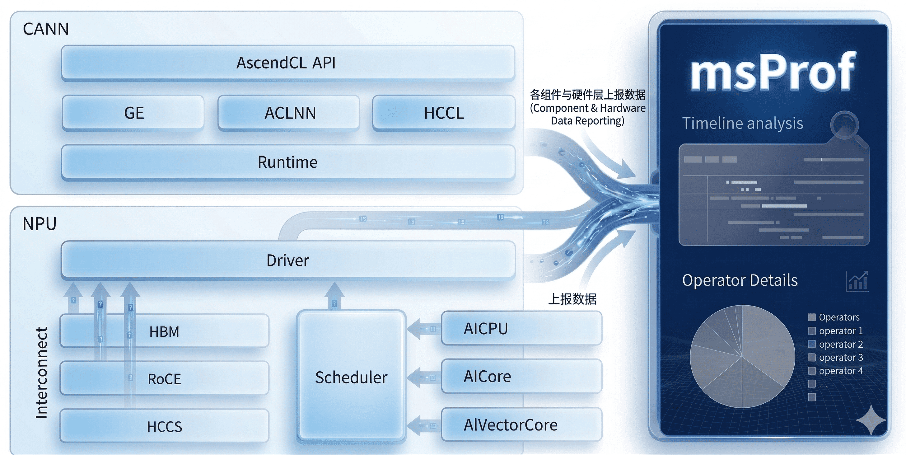

<h1 align="center">MindStudio Profiler</h1>
<div align="center">
  <p>🚀 <b>昇腾性能采集工具</b></p>

[📖工具文档](https://www.hiascend.com/document/detail/zh/CANNCommunityEdition/850alpha002/devaids/Profiling/atlasprofiling_16_0010.html) |
[🔥昇腾社区](https://www.hiascend.com/developer/software/mindstudio)|
[🌐Release](https://gitcode.com/Ascend/msprof/releases)

</div>

## 📢 最新消息

* [2025.12.30]：MindStudio Profiler项目首次上线 

## 📌 简介

MindStudio Profiler（msProf）是面向 AI 训练与推理场景的性能分析工具，支持采集与解析 CANN 平台及昇腾 AI 处理器的软硬件性能数据，帮助定位模型训练或推理过程中的性能问题。



## 功能介绍

| 功能点        | 功能简介 |                                                                资料链接                                                                |  源码仓库 |
|------------| --- |:----------------------------------------------------------------------------------------------------------------------------------:|-----------|
| **性能数据采集** | 通过 `msProf` 命令采集 CANN 平台及昇腾 AI 处理器的软硬件性能数据。 | [点击查看](https://www.hiascend.com/document/detail/zh/CANNCommunityEdition/850alpha002/devaids/Profiling/atlasprofiling_16_0010.html) | [点击查看](https://gitcode.com/cann/runtime/tree/master/src/dfx/msprof)  |
| **性能数据解析** | 使用 `msProf` 工具对采集到的性能数据进行解析，生成可读的分析结果。 |                                       [点击查看](docs/zh/user_guide/msprof_parsing_instruct.md)                                        | [点击查看](https://gitcode.com/Ascend/msprof/tree/master/analysis)  |

### 工具安装

msProf 工具内置在 CANN Toolkit 开发套件中，推荐直接下载 CANN 包进行安装，具体请参见《[CANN软件安装指南](https://www.hiascend.com/document/detail/zh/canncommercial/850/softwareinst/instg/instg_0000.html?Mode=PmIns&InstallType=netconda&OS=openEuler)》。

CANN 包安装成功后，执行以下命令设置环境变量：  

```bash
# ${install_path} 为 CANN 软件的安装目录，例如：/usr/local/Ascend/ascend-toolkit。
source ${install_path}/set_env.sh
```  

运行以下命令验证安装是否成功:  

```bash
msprof --help
```  

如需通过源码编译方式安装，请参见 [《msProf 源码编译、安装指南》](docs/zh/getting_started/msprof_install_guide.md)。

## 快速入门

msProf 工具通过命令行调用，通用采集命令格式如下：

```bash
msprof --output=<输出目录> --application="<应用程序> <参数>"
```

示例：

```bash
# 示例1：采集Python任务
msprof --output=./output --application="python3 train.py"

# 示例2：采集Shell脚本拉起的AI任务
msprof --output=./output --application="./run_standalone_train.sh"
```

以 ResNet50 模型训练任务为例，[《msProf 快速上手》](docs/zh/getting_started/quick_start.md)贯穿性能调优全流程，帮助您在 10 分钟内快速体验 msProf 工具在数据采集、解析导出、性能分析等环节的核心功能。

## 目录结构

关键目录如下，详细信息参见  [目录结构说明](docs/zh/dir_structure.md)。

```text
.
├── .gitcode                  # 仓库元数据
├── analysis                  # 数据解析目录
├── build                     # 构建目录
│   └── build.sh              # 构建脚本
├── cmake                     # CMake 文件目录
├── docs                      # 文档目录
│   └── zh                    # 中文文档
├── misc                      # 其他工具
│   ├── function_monitor      # 轻量化函数监控工具
│   └── gil_tracer            # Python GIL 锁检测工具
├── samples                   # 工具样例目录
│   └── README.md             # 样例说明
├── scripts                   # 安装、升级相关脚本
├── test                      # 测试与覆盖率统计脚本
└── README.md                 # 项目说明文档
```

## 📝 相关说明

- [《贡献指南》](./CONTRIBUTING.md)

- [《License声明》](docs/zh/legal/license_notice.md) 

- [《安全声明》](docs/zh/legal/security_statement.md) 

- [《免责声明》](docs/zh/legal/disclaimer.md)  

## 💬 建议与交流

欢迎大家为社区做贡献。如果有任何疑问或建议，请提交 [Issues](https://gitcode.com/Ascend/msprof/issues)，我们会尽快回复。感谢您的支持。

## 🤝 致谢

本工具由华为公司的下列部门贡献：   

- 昇腾计算MindStudio开发部  

感谢来自社区的每一个PR，欢迎贡献。

## 关于MindStudio团队

华为MindStuido全流程开发工具链团队致力于提供端到端的昇腾AI应用开发解决方案，使能开发者高效完成训练开发、推理开发和算子开发。您可以通过以下渠道更深入了解华为MindStudio团队：
<div style="display: flex; align-items: center; gap: 10px;">
    <span>昇腾论坛：</span>
    <a href="https://www.hiascend.com/forum/" rel="nofollow">
        
    </a>
    <span style="margin-left: 20px;">昇腾小助手：</span>
    <a href="https://gitcode.com/Ascend/msinsight/blob/master/docs/zh/user_guide/figures/readme/xiaozhushou.png">
        
    </a>
</div>
