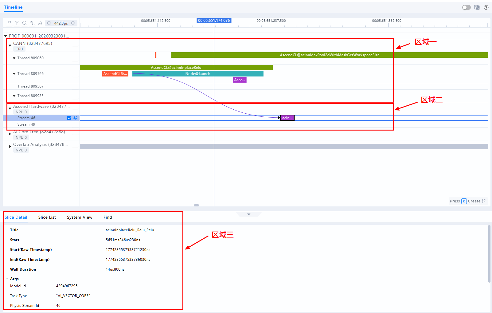
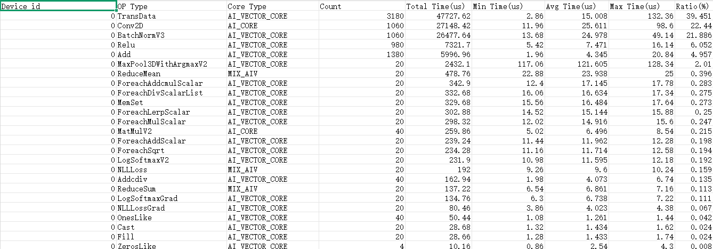

# 快速入门

本教程围绕以下三个环节展开，帮助您快速掌握 msProf 工具在性能数据采集与分析中的基本用法：

1. 环境准备：安装 msProf 工具并配置运行环境。
2. 采集：通过 msProf 命令行工具，完成第一份性能数据的采集。
3. 分析：基于生成的结果文件，展开初步的性能分析与瓶颈定位。

## 环境准备

- 请确保安装CANN Toolkit开发套件包和ops算子包，具体请参见《[CANN 软件安装指南](https://www.hiascend.com/document/detail/zh/canncommercial/850/softwareinst/instg/instg_0000.html?Mode=PmIns&InstallType=local&OS=openEuler)》。
- 执行以下命令设置环境变量：
 
    ```bash
    # ${install_path} 为 CANN 软件的安装目录，例如：/usr/local/Ascend/ascend-toolkit。
    source ${install_path}/set_env.sh
    ```  
  
- 运行以下命令验证安装是否成功:  

    ```bash
    # 查看msprof的安装位置
    which msprof
    # 查看msprof的命令参数
    msprof --help
    ``` 

## 采集、解析并导出性能数据

1. 执行以下命令，使用msProf工具拉起训练脚本并采集性能数据，训练脚本参见[Resnet50模型训练样例](#附录)。

   ```bash
   msprof --application="python train.py" --output=/home/prof_output
   ```
   
    > [!NOTE] 说明
    > - --output：收集到的性能数据的存放路径；
    > - --application：待采集性能数据的用户程序；
    > - 以上为最基本的采集命令，如有其他采集需求，请参见[性能数据采集和自动解析](https://www.hiascend.com/document/detail/zh/mindstudio/830/T&ITools/Profiling/atlasprofiling_16_0007.html#ZH-CN_TOPIC_0000002536038281)。
       
   打印如下信息，则表示运行成功：

    ```bash
    [INFO] Start profiling....
    [INFO] Using device: npu:0
    [Epoch 1/2] Average Loss: 2.4961
    [Epoch 2/2] Average Loss: 2.2166
    [INFO] Start export data in PROF_000001_20260323031749197_00815596RKPKAHRB..
    ...
    [INFO] Export all data in PROF_000001_20260323031749197_00815596RKPKAHRB. done.
    [INFO] Start query data in PROF_000001_20260323031749197_00815596RKPKAHRB..
    Job Info        Device ID       Dir Name        Collection Time                 Model ID   Iteration Number Top Time Iteration      Rank ID
    NA                              host            2026-03-23 03:17:50.944273      N/A        N/A              N/A                     -1     
    NA              0               device_0        2026-03-23 03:17:50.954390      N/A        N/A              N/A                     -1     
    [INFO] Query all data in PROF_000001_20260323031749197_00815596RKPKAHRB. done.
    [INFO] Profiling finished.
    [INFO] Process profiling data complete. Data is saved in /home/prof_output/PROF_000001_20260323031749197_00815596RKPKAHRB.
    ```

2. 命令执行完成后，在--output指定的目录下生成PROF_XXX目录，存放自动解析后的性能数据。

   ```ColdFusion 
    PROF_XXX
    ├── host   // Host侧性能原始数据，用户无需关注
    │    └── data
    ├── device_{id}   // Device侧性能原始数据，用户无需关注
    │       └── data
    ├── msprof_{timestamp}.db  // db格式的性能数据
    ├── mindstudio_profiler_output   // Host和各个Device的性能数据汇总
        ├── msprof_{timestamp}.json  // chrome格式timeline数据
        ├── op_summary_{timestamp}.csv // AI Core和AI CPU算子数据
        └── ...
   ```

## 性能分析

### Timeline数据可视化

建议使用[MindStudio Insight](https://gitcode.com/Ascend/msinsight)可视化工具加载PROF_XXX文件夹：

* 定位耗时较长的 API、算子及任务流 
* 通过 HostToDevice 连线分析下发关系


<div style="text-align: center;">
<strong>图1</strong> msprof_*.json文件可视化呈现
</div>

> 区域1：CANN层数据，主要包含Runtime等组件以及Node（算子）的耗时数据。   
> 区域2：底层NPU数据，主要包含Ascend Hardware下各个Stream任务流的耗时数据和迭代轨迹数据、昇腾AI处理器系统数据等。   
> 区域3：展示timeline中各算子、接口的详细信息（单击各个timeline色块展示）。  

### Summary数据分析

#### op_statistic_*.csv

op_statistic_*.csv文件按照算子类型（Op Type）归类，给出各类算子的调用总时间、总次数等，按照Total Time排序，找出耗时最长的算子类型，分析这类算子是否有优化空间。


<div style="text-align: center;">
<strong>图2</strong> op_statistic_*.csv文件示例
</div>

#### op_summary_*.csv

op_summary_*.csv文件包含算子的输入输出形状、PMU 等详细信息，其中Task Duration字段记录算子耗时。可按Task Duration排序定位高耗时算子，也可按Task Type排序查看不同核（AI Core和AI CPU）上的耗时分布，从而识别出高耗时算子，并进一步分析其优化空间。
从而找出高耗时算子，进而分析该算子是否有优化空间。


<div style="text-align: center;">
<strong>图3</strong> op_summary_*.csv文件示例
</div>

## 附录

Resnet50模型训练样例

```python
import torch
import torch.nn as nn
import torch.optim as optim
import torchvision.models as models
from torchvision.models import ResNet50_Weights


class ResNet50:
    def __init__(self, num_classes=1000, device=None):
        # Automatically choose the device: NPU > CUDA > CPU
        if device is None:
            if hasattr(torch, 'npu') and torch.npu.is_available():
                self.device = torch.device("npu:0")
            else:
                self.device = torch.device("cuda:0" if torch.cuda.is_available() else "cpu")
        else:
            self.device = torch.device(device)
        print(f"[INFO] Using device: {self.device}")

        # Load ResNet50 (with pretrained weights)
        self.model = models.resnet50(weights=ResNet50_Weights.IMAGENET1K_V1)
        if num_classes != 1000:
            self.model.fc = nn.Linear(self.model.fc.in_features, num_classes)
        self.model = self.model.to(self.device)

    def train(self, data_loader, epochs=1, lr=1e-4, freeze_backbone=False):
        """
        Simple training function.
        :param data_loader: torch.utils.data.DataLoader returning (images, labels)
        :param epochs: Number of epochs to train for
        :param lr: Learning rate
        :param freeze_backbone: Whether to freeze the ResNet backbone, only training the classification head
        """
        # Optionally freeze the backbone (useful for fine-tuning)
        if freeze_backbone:
            for param in self.model.parameters():
                param.requires_grad = False
            for param in self.model.fc.parameters():
                param.requires_grad = True

        # Optimize only parameters that require gradients
        params_to_optimize = [p for p in self.model.parameters() if p.requires_grad]
        optimizer = optim.Adam(params_to_optimize, lr=lr)
        criterion = nn.CrossEntropyLoss().to(self.device)

        self.model.train()
        for epoch in range(epochs):
            total_loss = 0.0
            for inputs, labels in data_loader:
                inputs, labels = inputs.to(self.device), labels.to(self.device)

                optimizer.zero_grad()
                outputs = self.model(inputs)
                loss = criterion(outputs, labels)
                loss.backward()
                optimizer.step()

                total_loss += loss.item()

            avg_loss = total_loss / len(data_loader)
            print(f"[Epoch {epoch + 1}/{epochs}] Average Loss: {avg_loss:.4f}")


def train():
    trainer = ResNet50(num_classes=10)
    fake_images = torch.randn(80, 3, 224, 224)
    fake_labels = torch.randint(0, 10, (80,))
    dataset = torch.utils.data.TensorDataset(fake_images, fake_labels)
    loader = torch.utils.data.DataLoader(dataset, batch_size=8, shuffle=True)
    trainer.train(loader, epochs=2, lr=1e-3, freeze_backbone=True)


if __name__ == "__main__":
    train()
```
