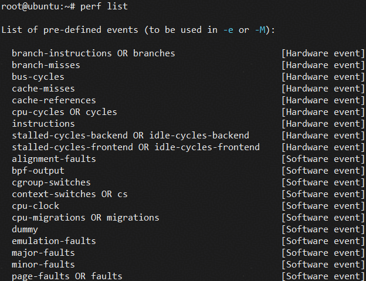
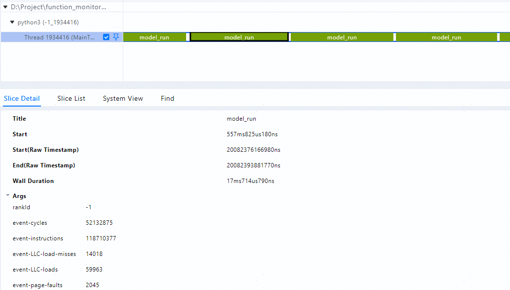

# Function Monitor

## 简介

在大模型训练或推理场景中，Host 侧性能抖动是影响模型运行效率的典型问题之一，可能造成 PyTorch 等 AI 框架的算子下发延迟，进而拖慢模型运行速度。这类问题根源在于 Host 侧复杂的软件栈交互（如 Python解释器、AI 框架、CANN 软件栈），难以精确定位。

为了解决这一问题，通过集成 openEuler [libkperf](https://gitcode.com/openeuler/libkperf) 轻量级 Linux 性能采集能力，我们开发了 Function Monitor 工具，用于监控 Host 侧函数的执行时间，低开销地采集指定函数执行过程中的 CPU PMU 指标（如 Cache Miss、Page Faults），并可与 Ftrace、MindStudio Profiler 数据联合分析，帮助用户更高效地识别 Host 性能问题并进行优化。

 **使用流程**

1. 通过 Python 装饰器或 with 语句实现对指定函数的执行时间及 CPU PMU 指标采集，支持基于耗时阈值进行数据过滤，并将采集结果持久化写入日志文件。
2. 将采集的日志文件后处理，转换为 Chrome Trace Json 格式。
3. 导入[MindStudio Insight](https://www.hiascend.com/document/detail/zh/mindstudio/830/GUI_baseddevelopmenttool/msascendinsightug/Insight_userguide_0002.html)，进行可视化展示，分析函数执行耗时与 CPU PMU 指标之间的关系。

## 注意事项

+ 仅支持在 **PyTorch** 框架下使用，其他 AI 框架暂不支持。
+ 当设置 **ENABLE_LIBKPERF** 环境变量为 True，采集 CPU PMU 指标时，需要确保当前用户为 root 或具有 root 权限。
+ function_monitor.py 中提供的 `@function_monitor` 装饰器与 `FunctionMonitorContext` 上下文管理器可**同时使用**，分别在不同函数或代码块中采集数据，但**不可在同一函数或代码块内叠加使用**，若某函数已被 `@function_monitor` 装饰，再在该函数内部使用 `FunctionMonitorContext` 上下文管理器，**可能导致数据采集异常**。

## 使用前准备

1. 编译安装 libkperf python whl 包，参考 《[libkperf 编译指南](https://gitcode.com/openeuler/libkperf#%E7%BC%96%E8%AF%91)》。
2. 获取仓库中提供的采集、转换脚本 [function_monitor.py](./function_monitor.py)，[log2trace.py](./log2trace.py)，以及文件操作相关脚本（[file_manager.py](./file_manager.py)）。

## 数据采集

支持通过 Python 函数装饰器和 with 语句两种方式进行数据采集，以下为两种方式均适配的环境变量配置说明：

| 环境变量 | 可选/必选 | 说明 |
| --- | --- | --- |
| ENABLE_FUNCTION_MONITOR | 可选 | 指定是否开启 Function Monitor 函数监控采集，支持设置为 True 或 False，若需要开启函数监控采集，必须设置为 True，默认值为 False， 表示不开启 |
| ENABLE_LIBKPERF | 可选 | 指定是否使用 libkperf 采集 CPU PMU 指标，支持设置为 True 或 False，默认值为 False， 表示不开启 |
| FUNCTION_MONITOR_LOG_PATH | 可选 | 指定函数监控采集日志文件的存储路径，若未指定，则默认存储在当前用户主目录下的 function_monitor_log 目录（如 /home/user/function_monitor_log） |

当设置 **ENABLE_LIBKPERF** 环境变量为 True 时，采集 CPU PMU 指标时，用户可在 `function_monitor.py` 中 `PerformanceMonitor` 类的 `evt_list` 参数中指定要采集的 perf event 列表，默认值为 **['cycles', 'instructions', 'LLC-load-misses', 'LLC-loads', 'page-faults']。**

当前系统支持的 perf event 列表可通过 `perf list` 命令查看，详细说明可参考 [perf event 官方文档](https://man7.org/linux/man-pages/man1/perf-list.1.html)，用户可根据实际需求选择要采集的 perf event。



### 方式一：通过函数装饰器进行采集

function_monitor.py 中提供函数装饰器 `@function_monitor`，用户可以将数据采集逻辑精细地嵌入到应用程序的指定函数中，实现对该函数执行时间及 CPU PMU 指标的采集。

**参数说明**

| 参数 | 可选/必选 | 说明 |
| --- | --- | --- |
| func_name | 可选 | 设置要采集数据的函数名称，若未指定，则默认为当前被装饰的函数名称 |
| process_name | 可选 | 设置采集数据的进程名称，若未指定，则默认为当前进程名称 |
| threshold_ms | 可选 | 设置采集数据的耗时阈值，只有函数执行耗时大于该阈值，才会记录到日志文件中，单位为 ms，若未指定，则默认为 1 |

**使用示例**

1. 设置环境变量

```bash
export ENABLE_FUNCTION_MONITOR=True
export ENABLE_LIBKPERF=True
export FUNCTION_MONITOR_LOG_PATH=${HOME}/function_monitor_log
```

2. 修改 function_monitor.py 中 `PerformanceMonitor` 类的 `evt_list` 参数，指定要采集的 perf event 列表为 **['cycles', 'instructions', 'LLC-load-misses', 'LLC-loads', 'page-faults']**

```python
class PerformanceMonitor:

    def __init__(self, evt_list=None, pid_list=None, cpu_list=None):
        # ...
        try:
            self._kperf = importlib.import_module('kperf')
            # set perf event list
            self.evt_list = evt_list or [
                'cycles', 'instructions', 'LLC-load-misses', 'LLC-loads', 'page-faults'
            ]
        except Exception as e:
            self.logger.error(f"Failed to import kperf module: {e}")
            self.monitor_enabled = False
```

3. 在 PyTorch 模型脚本中引入 `@function_monitor` 装饰器，将需要采集数据的函数进行装饰

```python
import os
import torch
from function_monitor import function_monitor

@function_monitor(func_name='model_run', threshold_ms=1)
def model_run():
    size = 1024
    A = torch.rand(size, size, dtype=torch.float32, requires_grad=False).npu()
    B = torch.rand(size, size, dtype=torch.float32, requires_grad=False).npu()

    for i in range(10):
        C = torch.matmul(A, B)
        D = torch.nn.functional.relu(C)
        E = torch.nn.functional.layer_norm(D, D.size()[1:])

if __name__ == '__main__':
    for i in range(10):
        model_run()
```

**输出说明**

采集结束后，会在环境变量 `FUNCTION_MONITOR_LOG_PATH` 配置的路径下（默认为当前用户主目录下的 function_monitor_log 目录）生成对应的日志文件，文件名格式为 `function_monitor_<pid>.log`，其中 `<pid>` 为进程 PID。

### 方式二：通过 with 语句进行采集

function_monitor.py 中还提供了上下文管理器 `FunctionMonitorContext`，用户可以将数据采集逻辑封装在 with 语句块中，实现对指定代码块的执行时间及 CPU PMU 指标的采集。

**参数说明**

| 参数 | 可选/必选 | 说明 |
| --- | --- | --- |
| func_name | 必选 | 设置要采集数据的函数名称 |
| process_name | 可选 | 设置采集数据的进程名称，若未指定，则默认为当前进程名称 |
| threshold_ms | 可选 | 设置采集数据的耗时阈值，只有函数执行耗时大于该阈值，才会记录到日志文件中，单位为 ms，若未指定，则默认为 1 |

**使用示例**

1. 设置环境变量

```bash
export ENABLE_FUNCTION_MONITOR=True
export ENABLE_LIBKPERF=True
export FUNCTION_MONITOR_LOG_PATH=${HOME}/function_monitor_log
```

2. 修改 function_monitor.py 中 `PerformanceMonitor` 类的 `evt_list` 参数，指定要采集的 perf event 列表为 **['cycles', 'instructions', 'LLC-load-misses', 'LLC-loads', 'page-faults']**

```python
class PerformanceMonitor:

    def __init__(self, evt_list=None, pid_list=None, cpu_list=None):
        # ...
        try:
            self._kperf = importlib.import_module('kperf')
            # set perf event list
            self.evt_list = evt_list or [
                'cycles', 'instructions', 'LLC-load-misses', 'LLC-loads', 'page-faults'
            ]
        except Exception as e:
            self.logger.error(f"Failed to import kperf module: {e}")
            self.monitor_enabled = False
```

3. 在 PyTorch 模型脚本中引入 `FunctionMonitorContext` 上下文管理器，将需要采集数据的代码块封装在 with 语句块中

```python
import os
import torch
from function_monitor import FunctionMonitorContext

def model_run():
    size = 1024
    A = torch.rand(size, size, dtype=torch.float32, requires_grad=False).npu()
    B = torch.rand(size, size, dtype=torch.float32, requires_grad=False).npu()

    with FunctionMonitorContext(func_name='torch_operator_run', threshold_ms=1):
        for i in range(10):
            C = torch.matmul(A, B)
            D = torch.nn.functional.relu(C)
            E = torch.nn.functional.layer_norm(D, D.size()[1:])

if __name__ == '__main__':
    for i in range(10):
        model_run()
```

**输出说明**

采集结束后，会在环境变量 `FUNCTION_MONITOR_LOG_PATH` 配置的路径下（默认为当前用户主目录下的 function_monitor_log 目录）生成对应的日志文件，文件名格式为 `function_monitor_<pid>.log`，其中 `<pid>` 为进程 PID。

## 数据后处理

采集结束后，可使用 **log2trace.py** 脚本将采集到的日志文件转换为 Chrome Trace Json 格式，以便导入 MindStudio Insight 可视化工具联合展示与分析。

**使用方式**
```bash
python log2trace.py --input <input_file> --output <output_file>
```

**参数说明**

| 参数 | 可选/必选 | 说明 |
| --- | --- | --- |
| --input | 必选 | 指定输入的 function_monitor 采集日志文件路径，需指定到文件名 |
| --output | 可选 | 指定输出的 Chrome Trace Json 文件路径，需指定到文件名, 若未指定，则默认在当前目录下生成与输入文件名相同但后缀为 '_trace.json' 的文件 |

**使用示例**
```bash
python log2trace.py --input function_monitor_12345.log --output function_monitor_12345_trace.json
```

## 数据可视化

将转换后的 Chrome Trace Json 文件导入 MindStudio Insight 可视化工具，即可展示函数执行时间及 CPU PMU 指标的采集情况。



其中，每个色块表示一个函数执行事件，包含函数名称、执行耗时等信息，Args 里包含了函数执行过程中的 CPU PMU 指标信息，如 Page Fault 次数、LLC 缓存 Miss 次数等。

## 安全说明

由于 **libkperf** 库底层限制，调用 **function_monitor.py** 中定义的装饰器或接口时，需要确保当前用户有足够的权限（root 权限），否则可能会导致采集数据失败。

数据后处理脚本 **log2trace.py** 无特殊权限要求，可在普通用户权限下运行。
